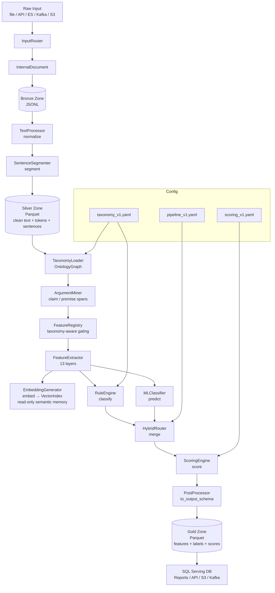

# NLPpipeline — Deterministic, Config-Driven Media NLP System

A deterministic, configuration-driven NLP processing framework for high-integrity media and document analysis. The system emphasises reproducibility, auditability, modularity, and strict schema-validated outputs.

> **Core invariant:** Given identical input and identical configuration, the pipeline produces byte-identical output across runs, platforms, and environments. This makes it suitable for audit-sensitive environments — media analysis, decision support, policy evaluation, and compliance-regulated content pipelines.

---

## Status — what actually runs today

Most of this document describes the intended full system. This section describes the part that
is built, tested and working as of **2026-08-21**.

**Working end to end:** a document goes in, a schema-validated JSON report comes out, every
finding is a verbatim substring of the source at the character offsets given, and two runs
produce byte-identical bytes. 125 tests pass.

```
git clone <this repo> && cd NLPpipline
py -3.10 -m venv .venv
.venv\Scripts\python.exe -m pip install pyyaml pysbd jsonschema numpy pytest charset-normalizer
.venv\Scripts\python.exe src\main.py --input data
aw\sample_article.txt
.venv\Scripts\python.exe -m pytest
```

Add `--save` to store the record where `output.type` in `conf/pipeline_v1.yaml` says
(`jsonl` by default). For the HTTP service:

```
.venv\Scripts\python.exe -m pip install fastapi uvicorn
.venv\Scripts\python.exe -m uvicorn api.service:app --app-dir src
# then GET /health, POST /analyze {"text": "..."}, POST /analyze/batch, docs at /docs
```

| Area | State |
|---|---|
| Ingestion | `.txt` proven end to end. `.md .pdf .docx .csv .tsv .json .jsonl .html .htm .xml` are wired into `EXTENSION_MAP` and import cleanly, but each needs its own library installed (`pdfplumber`, `python-docx`, `beautifulsoup4`, `pandas`) and none has been exercised. |
| Preprocessing | Working. Tokenises with true character offsets and never rewrites the text. |
| Segmentation | Working. pysbd, paragraph-first, exact offsets, handles hard-wrapped plain text. |
| Detection | **21 categories** from `claudenew.md` §12.2/§13.2, across 5 detector kinds (lexicon, regex, regex-unless, co-occurrence, document-level repetition). Precision-first; every category has a passing false-positive test against neutral text and against properly-sourced writing. |
| Scoring | Per-category scores, the severity/disruption model (§12.4) and six composites (§21). **No composite headline number is published** — the detectors are not calibrated, so `composite` is `null` and `expose_composite` defaults to false. The breakdowns are always published. |
| Batch | `classify_batch` (single process) and `preprocess_ray` (distributed) — tested to produce identical output. A Spark job and an Airflow DAG are written but need a JVM and Linux respectively. |
| Output | `data_schema/output_schema.json`, validated on every run. Contains no timestamp, by design. |
| Storage | JSONL and per-document JSON work with no extra dependencies; Parquet needs `pyarrow`. |
| API | `/health`, `/analyze`, `/analyze/batch` on FastAPI. |
| Not built | feature layers, ML classifier, hybrid router, embeddings, FAISS, ontology graph, the non-file ingestion adapters, the C++/CUDA accelerators. Nine detector categories are parked because they need NLI, embeddings, other articles or an external knowledge base — listed with reasons in `observe.md` §10.6. |

Scores are **uncalibrated**. No labelled evaluation set has been used, so the numbers describe how
much evidence was found, not how biased a piece is. Determinism is an audit property: it proves a
result can be re-derived, not that it is correct.

**One result worth knowing about.** `claudenew.md` §21.1 gives PropScore as a noisy-OR,
`1 - prod(1 - v)`. That assumes propaganda techniques are statistically independent; they
co-occur heavily, so the product saturates. On the sample article it returns **0.93**, where
§13.1's own calibration target for an ordinary news article is 0.1-0.2. Both aggregators are
implemented and `prop_score_method` selects; the default is a smooth-max, which returns 0.48 on
the same evidence. See `observe.md` §10.4.

Line-by-line notes on every module live in `observe.md` §8-§10.

---

## Contents

1. [Overview](#1-overview)
2. [Architecture](#2-architecture)
3. [Directory Layout](#3-directory-layout)
4. [Pipeline Stages](#4-pipeline-stages)
5. [Determinism Model](#5-determinism-model)
6. [Scoring Mathematics](#6-scoring-mathematics)
7. [Taxonomy Versioning Strategy](#7-taxonomy-versioning-strategy)
8. [Configuration Reference](#8-configuration-reference)
9. [Tech Stack](#9-tech-stack)
10. [Developer Workflow](#10-developer-workflow)
11. [Docker Execution](#11-docker-execution)
12. [Airflow Integration](#12-airflow-integration)
13. [Testing & QA](#13-testing--qa)
14. [API Contract](#14-api-contract)
15. [Canonical Parquet Schema](#15-canonical-parquet-schema)
16. [Extension Points](#16-extension-points)
17. [Operational Considerations](#17-operational-considerations)

---

## 1. Overview

`NLPpipeline` transforms raw documents from any source (files, APIs, streams, databases) into structured, taxonomy-mapped, and score-annotated JSON outputs.

Capabilities:

- Multi-source ingestion (PDF, DOCX, CSV, JSON, HTML, Parquet, Elasticsearch, Kafka, S3, scrapers)
- Deterministic rule-based classification driven by `conf/taxonomy_v1.yaml`
- Optional ML fallback classifier (ONNX-exported model)
- Hybrid deterministic routing — rules take precedence, ML fills gaps
- Config-driven scoring engine (`conf/scoring_v1.yaml`)
- Sentence-level multi-label classification with text span offsets
- Taxonomy graph (networkx DAG) for hierarchical label propagation
- Optional ONNX sentence embeddings + FAISS vector index
- FastAPI service layer for backend integration
- Airflow-orchestrated batch runs
- Pydantic-enforced I/O schema validation

---

## 2. Architecture

### Data Flow

The pipeline uses a **Bronze / Silver / Gold** data lake architecture. Each zone is an inter-stage Parquet/JSONL checkpoint.



### Data lake zones

| Zone | Format | Stage written at | Contents |
|---|---|---|---|
| Bronze | JSONL | After `InputRouter` | Raw documents, source metadata, `InternalDocument` rows |
| Silver | Parquet | After `SentenceSegmenter` | Clean text, tokens, sentences, entities, NER spans |
| Gold | Parquet | After `PostProcessor` | Features, labels, scores, pipeline version stamp |
| Serving | SQL DB / S3 | After Gold write | Query-ready; feeds API, dashboards, reports |

### Classification Tiers

| Tier | Module | Trigger |
|---|---|---|
| 1 — Rule-based | `rules_engine.py` | Always runs first |
| 2 — ML fallback | `ml_classifier.py` | When rule confidence < threshold |
| 3 — Hybrid merge | `hybrid_router.py` | Always; blends tier-1 and tier-2 |

---

## 3. Directory Layout

```
NLPpipline/
├── CLAUDE.md                        # Project context for AI-assisted development
├── README.md
├── Dockerfile
├── .dockerignore
├── pyproject.toml                   # Package metadata + build config (setuptools)
├── requirements-dev.txt             # Pinned dev dependencies
│
├── conf/
│   ├── taxonomy_v1.yaml             # Category definitions, hierarchy, rule sets  ← EMPTY, fill first
│   ├── scoring_v1.yaml              # Scoring weights, operators, blend modes      ← EMPTY
│   └── pipeline_v1.yaml             # Pipeline toggles, input/output config, seeds
│
├── data/                            # Runtime data directories (gitignored)
│   ├── raw/                         # Source documents before processing
│   ├── validated/                   # Post-validation, pre-processing
│   ├── normalized/                  # Post-preprocessing output
│   ├── extracted/                   # Extracted features / embeddings
│   ├── failed/                      # Documents that failed processing
│   └── logs/                        # Per-run data logs
│
├── data_schema/
│   ├── input_schema.json            # Contract for ingestion layer     ← placeholder, needs writing
│   └── output_schema.json           # Contract for backend/frontend    ← placeholder, needs writing
│
├── src/
│   ├── core/
│   │   ├── internal_document.py     # InternalDocument — THE pipeline data contract  ← COMPLETE
│   │   └── exceptions.py            # Exception hierarchy                            ← COMPLETE
│   │
│   ├── nlp_pipeline/
│   │   ├── shared_types.py          # NormalizedDocument, Sentence — currently empty stubs
│   │   ├── preprocessing.py         # Normalization, noise removal, Unicode, lemmatization
│   │   ├── segmentation.py          # Deterministic sentence splitting (pysbd + spaCy)
│   │   ├── features.py              # Feature extraction: n-grams, TF-IDF, embeddings
│   │   │                            #   Categories: LogicalFallacy, Rhetorical, Bias,
│   │   │                            #   Sentiment_Subjectivity, Stance, FactCheck,
│   │   │                            #   Linguistic, Mathematics, Deterministic, Metadata
│   │   ├── rules_engine.py          # Rule-based taxonomy classifier
│   │   ├── ml_classifier.py         # Optional ML classifier (sklearn / ONNX)
│   │   ├── hybrid_router.py         # Deterministic rule → ML fallback routing
│   │   ├── ontology_graph.py        # Taxonomy DAG ops (ancestors, descendants, projection)
│   │   ├── scoring_engine.py        # Score computation per taxonomy node
│   │   ├── postprocessing.py        # Schema alignment, span offsets, version stamps
│   │   ├── embeddings_onnx.py       # ONNX sentence embeddings (MiniLM / SentenceTransformers)
│   │   ├── vector_index.py          # FAISS index (upsert / search)
│   │   ├── gpu_router.py            # CPU vs CUDA path selection (routes to gpu_support/)
│   │   ├── deterministic_utils.py   # Seeding, hashing, config version stamping
│   │   └── extras.py                # Summarization (optional)
│   │
│   ├── taxonomy_tools/
│   │   ├── taxonomy_loader.py       # YAML loader + schema validation
│   │   ├── taxonomy_versioning.py   # Version diffs, migration maps
│   │   └── taxonomy_suggestions.py  # Embedding-based clustering → new node proposals
│   │
│   ├── io_adapters/
│   │   ├── input_router.py          # Routes any raw input → InternalDocument
│   │   ├── file_readers.py          # Per-format readers (TXT, PDF, DOCX, CSV, JSON, HTML…)
│   │   ├── ingest_clients.py        # All pull adapters: APIClient, ESClient, KafkaClient,
│   │   │                            #   S3Client, ScraperClient, RedisClient
│   │   ├── storage_clients.py       # All writers: ParquetWriter, JSONLWriter, RedisWriter,
│   │   │                            #   LocalStorageWriter, StorageClientFactory
│   │   └── shared_types.py          # Duplicate stub — real types live in core/
│   │
│   ├── core_accelerators/           # C++ CPU acceleration (stub — not yet implemented)
│   │   ├── text_ops.cpp / .h        # Heavy text ops: normalization, prefix scans
│   │   ├── nlp_accel.cpp            # Higher-level NLP acceleration
│   │   ├── bindings.cpp             # PyBind11 bridge → Python
│   │   └── CMakeLists.txt           # CMake build config
│   │
│   ├── gpu_support/                 # CUDA GPU acceleration (stub — not yet implemented)
│   │   ├── cuda_ops.cu / .h         # CUDA kernels: batched similarity, vector ops
│   │   └── bindings.cpp             # PyBind11 bridge → Python
│   │
│   ├── batch_processing/
│   │   ├── classify_batch.py        # Batch classification entry point
│   │   ├── preprocess_ray.py        # Ray-distributed preprocessing
│   │   └── preprocess_spark.py      # Spark-distributed preprocessing
│   │
│   ├── api/
│   │   ├── service.py               # FastAPI microservice
│   │   └── models.py                # Pydantic request / response models
│   │
│   └── main.py                      # CLI entry point + pipeline wiring
│
├── airflow_dags/
│   └── media_nlp_batch_dag.py       # Batch orchestrator (cron, backfill)
│
├── tests/
│   ├── test_preprocessing.py        # Idempotency and normalization correctness
│   ├── test_segmentation.py         # Boundary stability across platforms
│   ├── test_rules_engine.py         # Rule evaluation determinism
│   ├── test_scoring_engine.py       # Score reproducibility
│   ├── test_determinism.py          # Same input twice → byte-identical output
│   └── test_output_schema.py        # Output validates against output_schema.json
│
├── notebooks/
│   ├── 01_exploration.ipynb
│   ├── 02_rules_design.ipynb
│   ├── 03_ml_baselines.ipynb
│   ├── 04_taxonomy_suggestions.ipynb
│   └── 05_text_functions.ipynb
│
├── models/                          # Model artifacts — gitignored, not yet created
│   ├── news_classifier.onnx         #   ML classifier (path set in pipeline_v1.yaml)
│   └── sentence_encoder.onnx        #   Sentence embeddings (path set in pipeline_v1.yaml)
│
└── logs/                            # Runtime logs and audit trails (gitignored)
```

### Layer roles at a glance

| Folder | Role | Data direction |
|---|---|---|
| `conf/` | Configuration — controls pipeline behaviour | Config only |
| `data_schema/` | Contract — defines I/O shapes for backend + QA | Contract only |
| `src/core/` | Foundation — `InternalDocument` and exceptions | Internal |
| `src/io_adapters/` | **Input stage** — all data enters the pipeline here | → In |
| `src/nlp_pipeline/` | **Core NLP** — all processing and classification | → Through |
| `src/taxonomy_tools/` | Taxonomy intelligence — load, version, suggest | Support |
| `src/api/` | Serving layer — FastAPI for real-time document analysis | ← Out |
| `src/batch_processing/` | Batch layer — Spark / Ray for large-scale runs | ← Out |
| `src/core_accelerators/` | CPU acceleration — C++ SIMD ops (stubbed) | Internal |
| `src/gpu_support/` | GPU acceleration — CUDA kernels (stubbed) | Internal |
| `airflow_dags/` | Orchestration — schedules batch jobs, does not process data | Schedule |
| `notebooks/` | **Research only** — not imported by any production code | Offline |
| `models/` | Trained artifacts — ONNX + pkl files loaded at runtime | Loaded |
| `tests/` | QA — validates correctness and determinism | Verify |

---

## 4. Pipeline Stages

### Preprocessing → Silver Zone

Canonicalises text and writes to Silver Parquet:

- Unicode normalisation (NFC)
- Whitespace compression
- Regex-based noise and boilerplate removal
- Deterministic lowercasing and token cleanup
- Optional NLTK stopword removal

Idempotency guarantee: `preprocess(preprocess(text)) == preprocess(text)`

### Segmentation

spaCy is used only as a boundary detector. All boundaries are post-validated:

- No non-deterministic models in the critical path
- Custom patch rules for domain-specific boundaries (headlines, sub-titles, lead paragraphs)
- Boundary positions are character-offset stable across CPU and GPU paths

### Argument Mining _(not yet implemented — `nlp_pipeline/argument_miner.py`)_

Sits between segmentation and feature extraction. Identifies argumentative structure in each sentence:

- **Claims** — assertions the author defends
- **Premises** — evidence or reasons supporting a claim
- **Support / Rebuttal spans** — links between claims and counter-claims
- Output is `List[ArgumentSpan]` consumed by `FeatureExtractor` and `RuleEngine`

Fallacy detection, PropScore, and stance classification depend on this structure. Build before `FeatureExtractor`.

### Feature Registry → Taxonomy-Aware Gating _(not yet implemented — `nlp_pipeline/feature_registry.py`)_

Consults `OntologyGraph` to gate which of the 13 feature layers run for a given document class. Prevents running all feature layers on every document.

Examples:
- "Opinion" → triggers Rhetorical, Fallacy, Sentiment, Framing layers
- "News Report" → triggers Factuality, Entity, Temporal layers
- "Scientific" → triggers Logical Fallacy, Factuality, Citation quality layers

The registry is YAML-defined and Git-versioned.

### Feature Extraction — 13 Layers

Produces a feature bundle consumed by both the rule engine and the ML classifier. The Feature Registry determines which layers run. Build in three phases:

#### Phase 1 (foundational — build first)

| Layer | Key outputs |
|---|---|
| 1. Textual/Structural | Sentence count, avg length, heading structure, list density |
| 2. Lexical/Vocabulary | N-grams, TF-IDF, vocabulary richness, loaded language flags |
| 5. Entity/Attribution | NER spans, quoted sources, citation presence |
| 6. Sentiment/Emotion | Polarity [-1,1], emotion distribution, subjectivity score |
| Embeddings | ONNX sentence embeddings → FAISS upsert (read-only memory) |

#### Phase 2 (classification layers)

| Layer | Key outputs |
|---|---|
| 7. Framing/Narrative | Framing cues, narrative arc markers |
| 8. Rhetorical/Persuasion | 13 propaganda technique scores (feeds PropScore) |
| 9. Logical Fallacy | 15 fallacy types × (confidence, span, severity) |
| 10. Factuality/Evidence | Claim count, source credibility, verification rate |

#### Phase 3 (cross-document — build last)

| Layer | Key outputs |
|---|---|
| 11. Temporal/Contextual | Date anchors, recency bias signals |
| 12. Cross-Document/Network | Cross-source entity co-occurrence, contradiction signals |
| 13. Metadata/Provenance | Source, author, publication date, pipeline version |

#### Feature storage strategy

| Feature type | Storage |
|---|---|
| Scalar values | Parquet columns (Gold zone) |
| List/nested (entity spans, sentences) | Nested Parquet structs |
| Embeddings | FAISS / Vector DB only (not Parquet) |
| Scores | Versioned Parquet columns with `pipeline_version` stamp |

#### Detected feature targets

**15 logical fallacy types** (`LogicalFallacy` class):
Ad Hominem, Straw Man, False Dilemma, Slippery Slope, Circular Reasoning, Hasty Generalization, Red Herring, Appeal to Authority, Appeal to Emotion, Bandwagon, Cherry Picking, False Cause, Equivocation, Appeal to Tradition, Appeal to Novelty

Each produces: `{fallacy_type, fallacy_span, confidence_score, severity}`

**13 propaganda / rhetorical techniques** (`Rhetorical` class):
Loaded Language, Name Calling, Glittering Generalities, Card Stacking, Bandwagon (Propaganda), Appeal to Fear, Appeal to Authority, Plain Folks, Testimonial, Transfer, Guilt by Association, Scapegoating, False Dilemma (Propaganda)

Each produces: `{technique, text_span, intensity}`

### Rule Engine

Loads `conf/taxonomy_v1.yaml` and evaluates per sentence:

- Phrase lists and lexicons
- Regex patterns
- Multi-token dependency patterns (spaCy Matcher)
- Negative / exclusion patterns
- Per-rule confidence scores

Rules are strictly ordered. The rule engine is the **primary and preferred** classification path.

### ML Classifier (Optional Fallback)

Invoked only when rule confidence is below the configured threshold:

- Input: feature bundle from `FeatureExtractor`
- Model: scikit-learn classifier or ONNX-exported transformer
- Inference is deterministic: fixed seeds, no dropout, frozen weights
- Model artifacts are version-pinned — no online updates

### Hybrid Router

```python
if rule_confidence >= threshold:           # threshold from pipeline_v1.yaml
    return rule_result
else:
    blended = α * conf_rules + (1-α) * conf_ml   # α from pipeline_v1.yaml
    return assign_labels(blended, thresholds)
```

Rules override ML when both fire for the same sentence. Blending weight `α` is config-driven.

### Scoring Engine

Computes document-level category scores from sentence-level classifications. Driven entirely by `conf/scoring_v1.yaml` — no scoring logic is hard-coded.

### Postprocessing

Assembles the final output JSON:

- Character-level text spans for each classified sentence
- Multi-label support per sentence
- Version stamps: pipeline, taxonomy, scoring
- Pydantic validation against `data_schema/output_schema.json`

### Acceleration Layer (Stubbed — not yet implemented)

Files exist but contain only 1-line comment stubs. Wire up when pipeline performance becomes a bottleneck after the core logic is working.

- **`src/core_accelerators/`** — C++ / SIMD path for heavy token operations (normalization, prefix scans). Exposed to Python via PyBind11 + CMake.
- **`src/gpu_support/`** — CUDA kernels for parallel feature extraction or vector ops. `gpu_router.py` decides at runtime whether to use this path based on device availability.

### Pipeline Orchestration — `main.py` target design

`main.py` should implement a `PipelineRunner` class that wires all stages together via constructor injection. This is the intended final design — currently `process_document()` and `run_pipeline()` are stubs.

```python
class PipelineRunner:
    def __init__(self, config):
        self.pre    = TextProcessor(config)
        self.seg    = SentenceSegmenter(config)
        self.feat   = FeatureExtractor(config)
        self.embed  = EmbeddingGenerator(config)      # optional
        self.rules  = RuleEngine(config)
        self.ml     = MLClassifier(config)            # optional
        self.hybrid = HybridRouter(self.rules, self.ml, config)
        self.score  = ScoringEngine(config)
        self.post   = PostProcessor(config)

    def run(self, doc: InternalDocument) -> ScoredDocument:
        normalized  = self.pre.normalize(doc)
        sentences   = self.seg.segment(normalized)
        features    = self.feat.build_features(normalized, sentences, doc.source_metadata)
        labels      = self.hybrid.merge(
                          self.rules.classify(features, sentences),
                          self.ml.predict(features, sentences),
                          ontology
                      )
        scores      = self.score.score(labels, features)
        return self.post.to_output_schema(doc, normalized, sentences, labels, scores)
```

API and batch processing both call `runner.run(doc)` — one entry point, regardless of source.

---

## 5. Determinism Model

Every component that introduces randomness is explicitly controlled:

| Source of randomness | Control mechanism |
|---|---|
| Python `random` | `random.seed(pipeline_conf.seed)` |
| NumPy | `np.random.seed(pipeline_conf.seed)` |
| PyTorch | `torch.manual_seed(pipeline_conf.seed)` |
| sklearn | `random_state=pipeline_conf.seed` on all estimators |
| ONNX inference | Deterministic by construction (frozen graph) |
| Rule evaluation | Strictly ordered; no stochastic branching |
| Segmentation | spaCy boundary detector + deterministic post-processing |

Additional guarantees:

- Taxonomy and scoring config are version-stamped at runtime
- Pipeline config + model artifacts are deployed atomically
- All outputs are validated against a fixed schema before storage
- `test_determinism.py` runs the same document twice and asserts byte-identical output

---

## 6. Scoring Mathematics

All scoring logic lives in `scoring_engine.py` and is driven by `conf/scoring_v1.yaml`. No scoring constants are hard-coded.

### Article-level score

```
score_article = Σ (w_c × s_c)   for each taxonomy category c
```

`w_c` — category weight from `scoring_v1.yaml`
`s_c` — normalised per-category signal (sentence fraction + rule bonuses/penalties)

Supports non-linear transforms and child-to-parent score propagation via the ontology graph.

### Hybrid confidence blend

```
conf(sentence, category) = α × conf_rules(sentence, category)
                         + (1 - α) × conf_ml(sentence, category)
```

`α` ∈ [0, 1] — configured in `pipeline_v1.yaml`. Default: `α = 1.0` (rules-only mode).

### Logical fallacy severity

```
s_i = c_i × w_f
```

`c_i` — rule/ML confidence for fallacy instance i
`w_f` — weight for that fallacy type from `scoring_v1.yaml` (reflects how severe the fallacy is)

### Logical flow disruption score

```
ℓ = max(s_i × d_fi)   over all detected fallacy instances i
```

`d_fi` — disruption factor for fallacy type f (domain constant from config)
Measures how much the detected fallacies break argument coherence.

### Propaganda score (PropScore)

```
PropScore = 1 - Π(1 - v_p)   for each propaganda technique p detected
```

`v_p` — intensity of technique p (0–1), from rule match strength
Product formula ensures multiple weak techniques compound into a high aggregate score.

### Factuality score

```
F = w1×r_vc + w2×σ̄ + w3×Cn + w4×Lf + w5×(1 - M)
```

| Variable | Meaning |
|---|---|
| `r_vc` | Claim verification rate (verified claims / total claims) |
| `σ̄` | Mean source credibility across cited sources |
| `Cn` | Internal consistency (absence of contradictions) |
| `Lf` | Logical flow score (ℓ is low) |
| `M` | Missing context penalty (fraction of key facts omitted) |
| `w1..w5` | Weights from `scoring_v1.yaml`, must sum to 1 |

### Embedding similarity (taxonomy suggestions)

```
d(i, j) = 1 - cos(e_i, e_j)
```

Exact cosine search (not approximate) preserves reproducibility across runs.

---

## 7. Taxonomy Versioning Strategy

Taxonomy changes follow a strict lifecycle to preserve historical reproducibility:

1. `taxonomy_suggestions.py` clusters low-confidence / unmatched sentences using k-means on sentence embeddings (fixed seed)
2. For each cluster: compute top keywords, representative examples, and proposed parent node
3. Output a **human-reviewable YAML diff** — no automatic taxonomy mutations
4. Approved diff is merged into `taxonomy_v2.yaml`
5. `taxonomy_versioning.py` records the diff and migration map (`v1 label → v2 label`)
6. Historical pipeline runs remain reproducible by pinning `taxonomy_v1.yaml`

Config changes that alter scoring behaviour require a `scoring_v2.yaml` increment. The active versions are stamped into every output document.

---

## 8. Configuration Reference

### `conf/pipeline_v1.yaml` — key fields

```yaml
pipeline:
  name: nlp_pipeline_v1
  version: 1.0.0
  seed: 42                        # Global RNG seed — must be an integer
  enable_ml_classifier: true      # false = rules-only mode
  enable_embeddings: true
  enable_vector_index: true

input:
  mode: pull                      # pull | push

ml:
  model_path: models/news_classifier.onnx
  model_type: onnx
  confidence_threshold: 0.7
  device: cpu                     # cpu | cuda | mps

embeddings:
  model_path: models/sentence_encoder.onnx
  embedding_dim: 384
  normalize: true

processing:
  batch_size: 32
  max_workers: 4
  error_handling: skip            # skip | stop | log
```

### `conf/taxonomy_v1.yaml`

Defines category hierarchy, keyword lists, regex patterns, and per-rule confidence scores. **Currently empty** — this is the first file to populate; all downstream stages depend on it.

### `conf/scoring_v1.yaml`

Defines per-category weights and scoring operators consumed by `ScoringEngine`. **Currently empty** — design alongside or immediately after the taxonomy.

---

## 9. Tech Stack

| Concern | Library |
|---|---|
| NLP / tokenization | spaCy 3.8, pysbd, NLTK, stanza |
| Sentence embeddings | onnxruntime, transformers (MiniLM / SentenceTransformers) |
| ML classifier | scikit-learn 1.7, onnxruntime |
| Vector search | FAISS, numpy |
| Taxonomy graph | networkx |
| File reading | pdfplumber, PyMuPDF, python-docx, pyarrow, pandas |
| API | FastAPI + uvicorn |
| Storage | redis, boto3 (S3), kafka-python, pyarrow (Parquet) |
| Batch processing | pyspark, Ray |
| Orchestration | apache-airflow |
| Validation | pydantic v2, jsonschema |
| Sentiment | vaderSentiment |
| OCR | pytesseract |

---

## 10. Developer Workflow

### Install

```bash
python -m venv pipe
.\pipe\Scripts\activate          # Windows
# source pipe/bin/activate       # macOS / Linux
pip install -r requirements-dev.txt
```

### Run API locally

```bash
uvicorn src.api.service:app --reload
# Docs at http://localhost:8000/docs
```

### Run pipeline directly

```bash
python -m src.main
```

### Run tests

```bash
pytest -q
flake8
black --check .
```

---

## 11. Docker Execution

```bash
# Build
docker build -t nlp-pipeline .

# Run
docker run -p 8000:8000 nlp-pipeline
```

All model files and configs must be present at build time. No external downloads at runtime.

---

## 12. Airflow Integration

`airflow_dags/media_nlp_batch_dag.py` orchestrates:

- Source ingestion
- Batch classification
- Scoring
- Storage handoff

Supports `LocalExecutor` for development and cloud-managed Airflow for production. The DAG is designed for both scheduled runs (cron) and historical backfill.

---

## 13. Testing & QA

Test suite validates:

| Test file | What it covers |
|---|---|
| `test_preprocessing.py` | Idempotency, normalisation correctness |
| `test_segmentation.py` | Boundary stability across CPU/GPU |
| `test_rules_engine.py` | Rule evaluation order and determinism |
| `test_scoring_engine.py` | Score reproducibility across seeds |
| `test_determinism.py` | Same input twice → byte-identical output |
| `test_output_schema.py` | Output JSON validates against `output_schema.json` |

---

## 14. API Contract

`src/api/service.py` accepts input conforming to `data_schema/input_schema.json` and returns:

```json
{
  "document_id": "sha256-hash",
  "pipeline_version": "1.0.0",
  "taxonomy_version": "v1",
  "scoring_version": "v1",
  "run_timestamp": "2026-05-23T00:00:00Z",
  "document_scores": {
    "bias": 0.73,
    "logical_fallacy": 0.12
  },
  "sentences": [
    {
      "text": "...",
      "span_start": 0,
      "span_end": 142,
      "labels": ["bias", "rhetorical"],
      "confidences": {
        "bias": 0.91,
        "rhetorical": 0.67
      }
    }
  ]
}
```

All responses are Pydantic-validated against `data_schema/output_schema.json` before being returned.

---

## 15. Canonical Parquet Schema

Every inter-stage Parquet write (Silver and Gold zones) must conform to this schema. The schema is the contract between pipeline stages — violating it breaks downstream consumers.

| Column | Type | Zone | Description |
|---|---|---|---|
| `doc_id` | string | Bronze+ | SHA-256 of source content |
| `source` | string | Bronze+ | Source identifier (URL, file path, API name) |
| `raw_text` | string | Bronze | Original text before any processing |
| `clean_text` | string | Silver | Post-normalization text |
| `tokens` | list[string] | Silver | Tokenized clean text |
| `sentences` | list[struct] | Silver | Sentence spans with character offsets |
| `entities` | list[struct] | Silver | NER spans (type, text, start, end) |
| `arguments` | list[struct] | Silver+ | Claim/premise/support spans (Argument Mining output) |
| `labels` | list[string] | Gold | Taxonomy labels assigned |
| `features` | struct | Gold | All feature values from 13 layers |
| `scores` | struct | Gold | All scoring formula outputs |
| `metadata` | struct | Bronze+ | Source metadata, author, date, language |
| `pipeline_version` | string | Gold | Semver of pipeline that produced this row |
| `taxonomy_version` | string | Gold | Taxonomy version used |
| `scoring_version` | string | Gold | Scoring config version used |
| `processed_at` | timestamp | Gold | Processing completion time (UTC) |

---

## 16. Extension Points

The pipeline is designed for controlled evolution. Extending any stage does not require changes to other stages:

| Module | How to extend |
|---|---|
| `feature_registry.py` | Add new taxonomy class → feature layer mappings in YAML |
| `argument_miner.py` | Swap argument mining model (spaCy → fine-tuned transformer) |
| `features.py` | Add feature category classes; swap TF-IDF → transformer embeddings |
| `rules_engine.py` | Add rule sets via `taxonomy_v1.yaml` — no code changes |
| `ml_classifier.py` | Swap any sklearn-compatible or ONNX-exported model |
| `hybrid_router.py` | Adjust blend weight `α` in config; add tie-breaking logic |
| `gpu_router.py` | Route heavy ops to CUDA path when available |
| `taxonomy_suggestions.py` | Wire to annotation tooling or active-learning loop |
| `io_adapters/storage_clients.py` | Add SQL serving DB, new cloud targets, message queues |
| `io_adapters/ingest_clients.py` | Add new pull sources |

---

## 17. Operational Considerations

- **Air-gap compatible** — no external downloads or network calls at runtime outside `io_adapters/`
- **Config changes require version increments** — taxonomy, scoring, and pipeline configs are stamped into every output
- **Atomic deployments** — config + model artifacts are deployed together; no partial-update states
- **Fully containerised** — Docker image is self-contained; python:3.10-slim base
- **Compliance-ready** — determinism + version stamps + audit logs satisfy traceability requirements
- **Logs** — written to `logs/`; can be disabled or redirected via `pipeline_v1.yaml`

---

## License

Internal / Private. Not for distribution.
